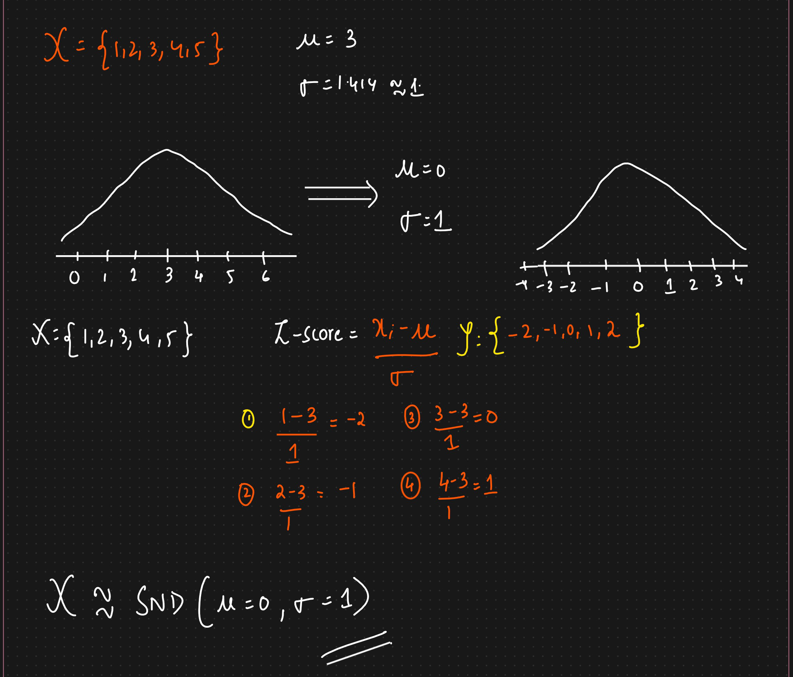

# End to End Project

* housing.head() -> To look at the top 5 rows
*

    <figure><figcaption></figcaption></figure>
* &#x20;Info -> To get a quick description of the data, in particular the total number of rows, each attribute’s type, and the number of non-null value
*

    <figure><figcaption></figcaption></figure>
* Object means its a categorical variable
* &#x20;housing.describe()
*

    <figure><figcaption></figcaption></figure>
*   &#x20;

    <figure><figcaption></figcaption></figure>
*   &#x20;

    <figure><figcaption></figcaption></figure>
* &#x20;Stratified sampling:
*   &#x20;

    <figure><figcaption></figcaption></figure>

**Discover and Visualize the Data to Gain Insights:**

*

    <figure><figcaption></figcaption></figure>
*

    <figure><figcaption></figcaption></figure>

Looking for Correlations:

*

    <figure><figcaption></figcaption></figure>
* The correlation coefficient ranges from –1 to 1
*

    <figure><figcaption></figcaption></figure>
* Another way to check for correlation between attributes is to use the pandas scatter\_matrix() function, which plots every numerical attribute against every other numerical attribute.
*

    <figure><figcaption></figcaption></figure>
*

    <figure><figcaption></figcaption></figure>
* The main diagonal (top left to bottom right) would be full of straight lines if pandas plotted each variable against itself, which would not be very useful. So instead pandas displays a histogram of each attribute

**Handling missing values**

1. Get rid of the corresponding districts.
2. Get rid of the whole attribute.
3. Set the values to some value

* Scikit-Learn provides a handy class to take care of missing values: SimpleImputer
*

    <figure><figcaption></figcaption></figure>
* Since the median can only be computed on numerical attributes, you need to create a copy of the data without the numerical attributes
*

    <figure><figcaption></figcaption></figure>
* The imputer has simply computed the median of each attribute and stored the result in its statistics\_ instance variable
*

    <figure><figcaption></figcaption></figure>
*

    <figure><figcaption></figcaption></figure>
* The result is a plain NumPy array containing the transformed features. If you want to put it back into a pandas DataFrame, it’s simple:
*

    <figure><figcaption></figcaption></figure>

**Handling Text and Categorical Attributes:**

*

    <figure><figcaption></figcaption></figure>
* Notice that the output is a SciPy sparse matrix, instead of a NumPy array
*

    <figure><figcaption></figcaption></figure>
* You can get the list of categories using the encoder’s categories\_ instance variable:
*

    <figure><figcaption></figcaption></figure>

**Custom Transformers:**

* Create a class and implement three methods: fit() (returning self), transform(), and fit\_transform()

Transformation Pipelines:

*

    <figure><figcaption></figcaption></figure>
* All but the last estimator must be transformers (i.e., they must have a fit\_transform() method)
* When you call the pipeline’s fit() method, it calls fit\_transform() sequentially on all transformers, passing the output of each call as the parameter to the next call until it reaches the final estimator, for which it calls the fit() method.
* Column transformer to apply the transformation on numerical as well as categorical data
*

    <figure><figcaption></figcaption></figure>
* Note that the OneHotEncoder returns a sparse matrix, while the num\_pipeline returns a dense matrix.&#x20;
* When there is such a mix of sparse and dense matrices, the ColumnTransformer estimates the density of the final matrix (i.e., the ratio of nonzero cells), and it returns a sparse matrix if the density is lower than a given threshold (by default, sparse\_threshold=0.3
* Instead of using a transformer, you can specify the string "drop" if you want the columns to be dropped, or you can specify "passthrough" if you want the columns to be left untouched. By default, the remaining columns (i.e., the ones that were not listed) will be dropped

**Select and Train a model:**

*

    <figure><figcaption></figcaption></figure>
*

    <figure><figcaption></figcaption></figure>
*

    <figure><figcaption></figcaption></figure>
* The main ways to fix underfitting are to select a more powerful model, to feed the training algorithm with better features, or to reduce the constraints on the model
*

    <figure><figcaption></figcaption></figure>
*

    <figure><figcaption></figcaption></figure>
*

    <figure><figcaption></figcaption></figure>
